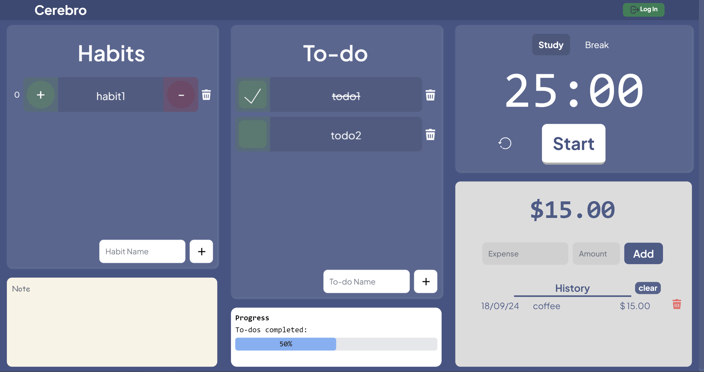

# Cerebro | All-in-One Productivity App

A fully responsive productivity app built with **Next.js 14** and **Supabase** that includes the following features:
- **Google OAuth Authentication**
- **Todo List**
- **Habit Tracker** 
- **Expense Tracker**
- **Pomodoro Timer**

## Live Demo

Check out the live app here: [Cerebro Productivity App](https://cere-bro.vercel.app/)

## Screenshot



## Database Schema

The following SQL schema is used for this project:

```sql
CREATE TABLE todos (
    id UUID PRIMARY KEY DEFAULT uuid_generate_v4(),
    name TEXT NOT NULL,
    is_done BOOLEAN DEFAULT FALSE,
    user_id UUID REFERENCES users(id) ON DELETE CASCADE
);
```

```sql
create table habits (
    id uuid default uuid_generate_v4() primary key,
    user_id uuid not null references auth.users (id) on delete cascade,
    name text not null,
    streak integer default 0,
    created_at timestamp default now()
);
```

```sql
create table expenses (
    id uuid default uuid_generate_v4() primary key,
    user_id uuid references auth.users(id) on delete cascade,
    date text not null,
    year text not null,
    name text not null,
    amount numeric(8, 2) not null,
    created_at timestamp default now()
);
```

```sql
CREATE TABLE notes (
    id SERIAL PRIMARY KEY,
    user_id UUID NOT NULL,
    content TEXT,
    created_at TIMESTAMP DEFAULT NOW(),
    updated_at TIMESTAMP DEFAULT NOW()
);
